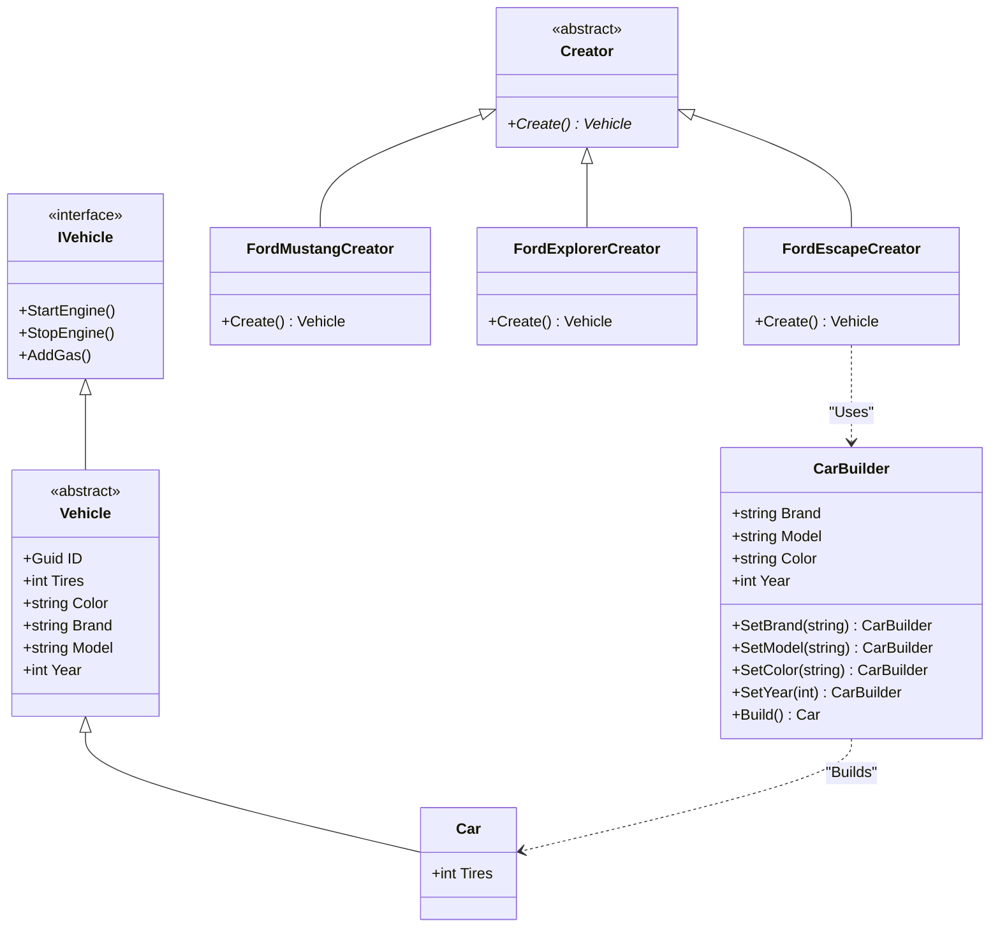
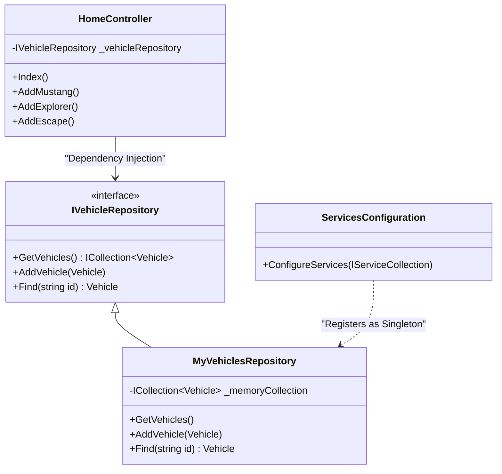

# Documento Técnico: Taller Formativo - Principios SOLID y Patrones de Diseño

## 1. Identificación del problema dentro de las restricciones del proyecto

### Problemas encontrados y análisis técnico
1. **Fallo en Patrón Repositorio y Violación de Inversión de Dependencias (DIP):**
   - El equipo de QA detectó que los métodos CRUD no funcionaban correctamente al agregar vehículos. Esto se debía a que `HomeController.Index()` accedía directamente a un Singleton `VehicleCollection.Instance` en lugar de utilizar el contrato `IVehicleRepository` inyectado. Esto acopla fuertemente el código y viola el principio DIP.
   - Además, la inyección de dependencias estaba configurando el repositorio como `Transient`, pero su estado dependía de un `Singleton` estático. Esto es un anti-patrón; el contenedor DI debe administrar el ciclo de vida, no la clase en sí.
2. **Esquema de BD no disponible:**
   - Como no existe base de datos, requerimos persistencia temporal en memoria sin crear dependencias estáticas difíciles de probar (mockear).
3. **Escalabilidad de propiedades (Open/Closed Principle):**
   - Se debe añadir la propiedad `Year` y preparar el código para 20 propiedades más en el próximo sprint. Añadir esto al constructor base de `Vehicle` crearía un "Telescoping Constructor", dificultando la inicialización y el mantenimiento.
4. **Adición de Nuevos Modelos Constantes:**
   - La arquitectura debe soportar la creación de nuevos modelos de autos (ej. Ford Escape) sin que el cliente o el controlador dependan fuertemente de la lógica de ensamblaje del modelo.

### Restricciones
- Solucionar los problemas de persistencia en memoria sin infraestructura de base de datos.
- Prevenir modificaciones masivas para futuros requerimientos del negocio.

---

## 2. Metodologías integrales y selección de Patrones

Para resolver los problemas identificados, se han seleccionado y aplicado los siguientes patrones:

### A. Dependency Injection (DI) y Reparación del Repository Pattern
Se elimina el Singleton estático (`VehicleCollection`). Ahora, `MyVehiclesRepository` encapsula su propia lista de `Vehicle`. En `ServicesConfiguration.cs`, se inscribe el repositorio como **Singleton** (`AddSingleton`) en el contenedor de dependencias. 
- **Justificación:** Esto asegura que la misma instancia de datos persista durante todo el tiempo de vida de la aplicación, permitiendo un manejo de estado limpio y completamente preparado para ser reemplazado fácilmente por una capa de base de datos (Ej: `DBVehicleRepository` con Entity Framework) más adelante.

### B. Patrón Builder (Constructor)
Se refactoriza y mejora el `CarBuilder` para gestionar las nuevas propiedades.
- **Justificación:** Al aislar la construcción de objetos complejos, podemos añadir propiedades por defecto (como `Year = DateTime.Now.Year`) y proveer métodos iterativos (`SetYear()`) sin alterar el modelo base continuamente. Esto cumple con OCP y previene constructores inflados.

### C. Patrón Factory Method (Método de Fábrica)
Se implementa `FordEscapeCreator` heredando de `Creator` para gestionar el ensamblaje de la `Ford Escape` usando el `CarBuilder`.
- **Justificación:** Permite agregar nuevos tipos de autos simplemente añadiendo nuevas clases "Creator" que devuelvan instancias listas del Vehículo. El código base no cambia.

---

## 3. Diagramas UML de Patrones Implementados

### UML: Factory Method + Builder

### UML: Dependency Injection / Repository Pattern

## 4. Diseño y Propuesta Técnica

**Prototipo Aplicado (Código Modificado):**
- **Refactor del Repositorio:** El Controlador ahora consume `_vehicleRepository.GetVehicles()`, logrando un 100% de desacoplamiento.
- **Implementación Builder:** Se añadió `Year` en `Vehicle` y en `CarBuilder`. Si llegan 20 propiedades nuevas en el siguiente Sprint, únicamente se extenderán variables y configuradores dentro de `CarBuilder`, sin necesidad de refactorizar la lógica central.
- **Implementación Factory:** Con `FordEscapeCreator` ya tenemos el auto de color `Red`, y de modelo `Escape` funcional.
- **Botones y Vistas:** Se incluyó "Add Escape" en la interfaz gráfica del `Index.cshtml`.
